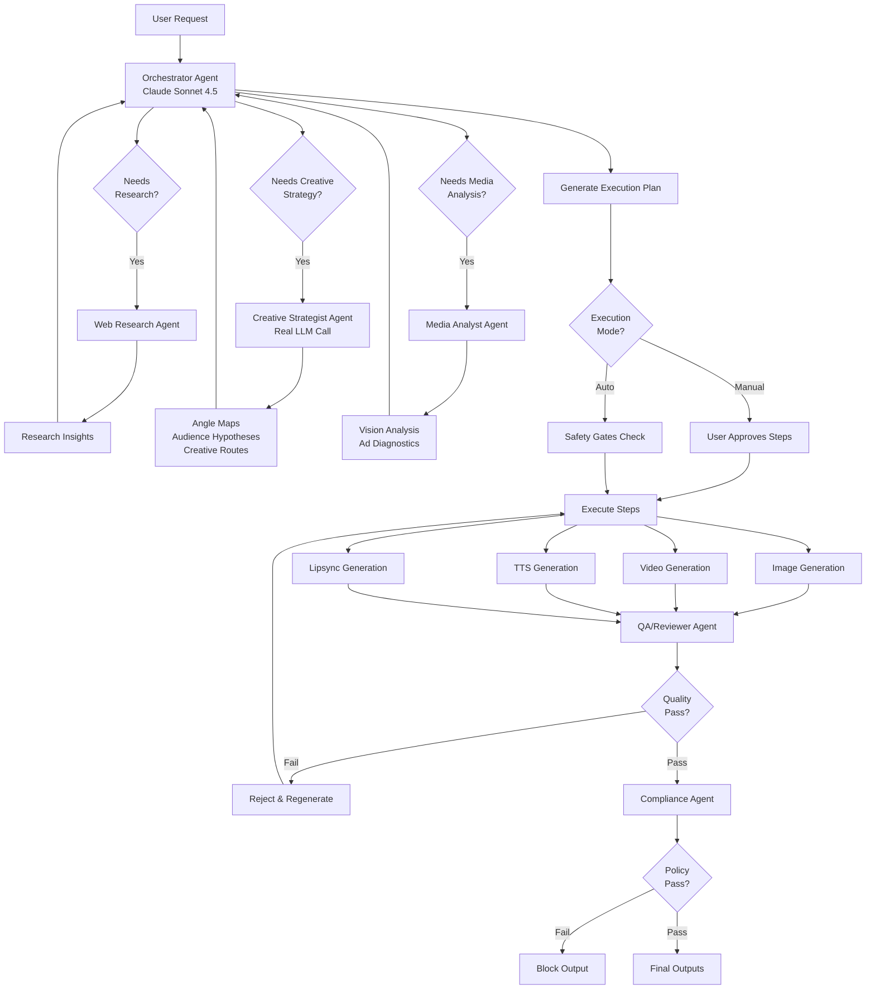

# Adz Creator Agent — Production-Ready Specification

**Version**: 1.0  
**Status**: Implementation-Ready  
**Last Updated**: December 23, 2025

---

## Table of Contents

1. [Executive Summary](#executive-summary)
2. [Architecture Overview](#architecture-overview)
3. [Multi-Agent System](#multi-agent-system)
4. [Advertising-Native Intelligence](#advertising-native-intelligence)
5. [Model Selection Logic](#model-selection-logic)
6. [Execution Modes](#execution-modes)
7. [Research & Media Understanding](#research--media-understanding)
8. [Safety Gates & Self-Correction](#safety-gates--self-correction)
9. [Tool Registry](#tool-registry)
10. [API Specifications](#api-specifications)
11. [Schemas & Data Structures](#schemas--data-structures)
12. [Cost & Performance](#cost--performance)
13. [Implementation Guide](#implementation-guide)

---

## Executive Summary

The **Adz Creator Agent** is an autonomous advertising assistant that transforms the existing Adz Creator platform into an advertising-native intelligence system. Unlike generic content generators, this agent functions as a **creative strategist, copywriter, and media planner** — capable of autonomously creating complete ad campaigns from minimal user input.

### Core Capabilities

- **Advertising-Native**: Autonomous creative strategy generation (audience hypotheses, angle maps, hooks, offers)
- **Extremely Flexible**: No rigid workflows; invents the optimal approach for each request
- **Research-Driven**: Web research integration (TikTok Creative Center, Meta Ads Library, trends)
- **Media-Aware**: Vision-based analysis of uploaded videos/images
- **Self-Correcting**: QA loops with novelty scoring and anti-generic enforcement
- **Controllable**: Manual mode by default, optional autopilot with safety gates

### Key Differentiators

1. **Not a Generator** — It's a **strategist**: When you ask for "ads," it generates audience hypotheses, angle maps, creative routes, and testing matrices.
2. **Not Template-Driven** — It's **inventive**: The workflow is dynamically created based on the specific request.
3. **Not Generic** — It's **novel**: Built-in rejection of bland outputs with novelty scoring.
4. **Not Isolated** — It's **research-aware**: Automatically researches trends and competitors when needed.

---

## Architecture Overview

### Hybrid Multi-Agent Architecture



### Agent Types

**Real LLM Agents** (Separate inference calls):
- **Orchestrator**: Main planning and routing agent
- **Creative Strategist**: Complex advertising strategy generation
- **QA/Reviewer**: Quality assessment and rejection
- **Compliance**: Platform policy verification

**Tool-Based Agents** (Structured prompts called via tool system):
- **Media Analyst**: Vision-based ad diagnostics
- **Hooks Engine**: Hook generation with novelty constraints
- **Script Generator**: Platform-specific ad scripts
- **Brand Voice Adapter**: Brand consistency enforcement

### Integration with Existing System

The agent **enhances** rather than replaces the current assistant system:

**Existing Components (Leveraged)**:
- `/app/api/assistant/run/route.ts`: Execution engine with SSE streaming
- `/lib/assistantTools.ts`: Tool registry and system prompt builder
- `/types/assistant.ts`: Core type definitions
- Model APIs: image, video, tts, lipsync, transcription, enhance, background_remove

**New Components (Added)**:
- `/lib/prompts/orchestrator.ts`: Enhanced advertising-native system prompt
- `/lib/prompts/agents/*`: Specialized sub-agent prompts
- `/lib/advertisingTools.ts`: Advertising-specific tool registry
- `/app/api/research/*`: Research endpoints
- `/lib/routing/modelSelector.ts`: Model selection decision trees
- `/lib/executionController.ts`: Manual/Auto mode controller

---

## Multi-Agent System

### 1. Orchestrator Agent

**Role**: Main brain; owns state, memory, routing, and execution.

**Responsibilities**:
- Parse user intent
- Decide which sub-agents to invoke
- Generate execution plans
- Route to appropriate models
- Enforce safety gates
- Stream progress updates

**System Prompt Location**: `/lib/prompts/orchestrator.ts`

**Key Behaviors**:
- **Research-First Mindset**: If user asks "what's working" or mentions trends/competitors, call research tools
- **Strategic Depth**: For "full ad" or "campaign" requests, invoke Creative Strategist
- **Media Awareness**: If user uploads video/image, invoke Media Analyst
- **Quality Enforcement**: Always route through QA/Reviewer before returning outputs
- **Cost Consciousness**: Track estimated costs and pause if budget exceeded

### 2. Creative Strategist Agent

**Role**: Advertising domain expert; generates comprehensive creative strategies.

**Invoked When**:
- User asks for "ads," "campaign," "creative strategy"
- Request is vague (e.g., "make me something for TikTok")
- User provides product info but no creative direction

**Outputs**:
```json
{
  "audience_hypotheses": [
    {
      "segment": "Busy professionals 25-40",
      "core_pain": "No time for meal prep",
      "desires": "Healthy, convenient meals",
      "belief_shifts": "Healthy eating can be quick",
      "objections": "Meal kits are expensive"
    }
  ],
  "angle_maps": [
    {
      "angle": "Problem-Solution",
      "hook_cluster": ["Tired of...", "If you struggle with...", "Stop wasting time..."],
      "body_structure": "Agitate problem → present solution → show proof",
      "cta": "Order your first box today"
    }
  ],
  "creative_routes": [
    {
      "route_id": "ugc_testimonial",
      "format": "UGC",
      "platform": "TikTok",
      "hypothesis": "Authentic user stories convert better than polished ads",
      "variants": 3
    }
  ]
}
```

**System Prompt Location**: `/lib/prompts/agents/creative_strategist.ts`

**Anti-Generic Rules**:
- NEVER use hooks like "Are you tired of..." without specific context
- MUST provide 3+ distinct creative routes
- MUST include testing hypothesis for each route

### 3. QA/Reviewer Agent

**Role**: Quality gatekeeper; rejects generic, bland, or off-brand outputs.

**Invoked**: After every generation step (image, video, script).

**Evaluation Criteria**:
```typescript
{
  novelty_score: number; // 0-100, reject if < 60
  brand_consistency: boolean;
  platform_appropriateness: boolean;
  hook_strength: number; // 0-100, reject if < 70 for ads
  clarity: boolean;
  rejection_reason?: string;
}
```

**System Prompt Location**: `/lib/prompts/agents/qa_reviewer.ts`

**Rejection Examples**:
- ❌ "Are you tired of feeling tired?" (Generic hook)
- ❌ "Click here to learn more" (Weak CTA)
- ❌ Stock photo aesthetic without brand markers
- ✅ "If you've ever meal-prepped on Sunday and eaten sad chicken by Wednesday..." (Specific, relatable)

### 4. Compliance Agent

**Role**: Platform policy enforcer; blocks outputs that violate ad policies.

**Invoked**: After QA approval, before final output.

**Platform Policies**:
- **TikTok**: No health claims without disclaimers, no "before/after" for weight loss, no shocking content
- **Meta (Facebook/Instagram)**: No misleading claims, proper landing page matching, no discriminatory targeting language
- **YouTube**: No misleading thumbnails, proper disclosures for sponsored content

**System Prompt Location**: `/lib/prompts/agents/compliance_checker.ts`

**Output**:
```typescript
{
  compliant: boolean;
  platform: 'tiktok' | 'meta' | 'youtube' | 'all';
  violations?: string[];
  recommendations?: string[];
}
```

### 5. Web Research Agent

**Role**: Fetch and synthesize advertising trends and competitor data.

**Invoked When**:
- User explicitly asks "what's working," "show me trends," "competitor analysis"
- Orchestrator detects low confidence in category knowledge
- Stakes are high (e.g., campaign launch)

**Data Sources**:
- TikTok Creative Center (top ads by category, hashtag performance)
- Meta Ads Library (competitor ad creatives, copy patterns)
- Trend aggregators (hook patterns, music trends, format trends)

**Output**:
```json
{
  "insights": [
    {
      "source": "TikTok Creative Center - Fitness Category",
      "trend": "UGC-style workout demos with voiceover narration",
      "confidence": "high",
      "citations": ["https://ads.tiktok.com/..."]
    }
  ],
  "competitor_examples": [
    {
      "brand": "Competitor X",
      "hook": "POV: You finally found a workout that doesn't feel like work",
      "format": "UGC, 9:16, 15s",
      "engagement_est": "high"
    }
  ]
}
```

**System Prompt Location**: `/lib/prompts/agents/web_research.ts`

### 6. Media Analyst Agent

**Role**: Analyze uploaded images/videos to extract ad principles.

**Invoked When**:
- User uploads media with request like "analyze this ad" or "make something like this"
- User provides competitor ad URL

**Capabilities**:
- **Vision Analysis**: Extract layout, style, colors, text, composition
- **Ad Diagnostics**: Identify hook, offer, CTA, pacing, platform fit
- **Variation Generation**: Suggest creative variations while maintaining core principles

**System Prompt Location**: `/lib/prompts/agents/media_analyst.ts`

**Output Example**:
```json
{
  "visual_analysis": {
    "layout": "Centered text overlay, subject left-of-center",
    "style": "High contrast, saturated colors, bold sans-serif typography",
    "text_content": "50% OFF - LIMITED TIME",
    "brand_elements": ["Logo top-right", "Brand color: #FF6B35"]
  },
  "ad_diagnostics": {
    "hook_type": "Discount urgency",
    "offer": "50% off first order",
    "cta": "Swipe up (implied by arrow graphic)",
    "platform_fit": "Instagram Story (9:16, 15s)",
    "effectiveness_estimate": "high"
  },
  "variation_suggestions": [
    "Test different urgency framing (e.g., 'Only 3 hours left')",
    "A/B test CTA placement (center vs bottom)",
    "Try testimonial overlay instead of discount"
  ]
}
```

---

## Advertising-Native Intelligence

### Core Advertising Frameworks

The agent must **natively understand** advertising concepts, not just generate media.

#### 1. Audience Hypotheses

Every campaign starts with audience segmentation and psychographic profiling.

**Structure**:
```typescript
type AudienceHypothesis = {
  segment: string; // Demographic + psychographic
  core_pain: string; // What keeps them up at night?
  desires: string; // What do they want to achieve?
  belief_shifts: string; // What belief must change?
  objections: string; // What stops them from buying?
  media_consumption: string[]; // Where do they spend time?
};
```

**Example**:
```json
{
  "segment": "First-time homebuyers 28-35, urban, college-educated",
  "core_pain": "Feeling overwhelmed by the mortgage process",
  "desires": "Clear, simple path to homeownership",
  "belief_shifts": "Getting a mortgage doesn't have to be confusing",
  "objections": "Don't trust online mortgage companies, prefer traditional banks",
  "media_consumption": ["Instagram Reels", "TikTok", "YouTube (how-to content)"]
}
```

#### 2. Angle Maps (Problem-Desire-Belief-Objection)

Angle maps are **strategic lenses** through which to frame the product.

**Structure**:
```typescript
type AngleMap = {
  angle_name: string;
  problem_hook: string; // Agitate the pain
  desire_amplification: string; // Paint the desired state
  belief_shift: string; // Reframe their thinking
  objection_handling: string; // Pre-empt resistance
  hook_examples: string[]; // 3-5 hooks for this angle
  body_structure: string; // Script flow
  cta: string; // Call to action
  platform_fit: string[]; // Best platforms for this angle
};
```

**Example**:
```json
{
  "angle_name": "Time-Freedom Angle",
  "problem_hook": "Spending 2 hours/day meal prepping when you'd rather be with family",
  "desire_amplification": "Imagine having healthy meals ready in 10 minutes",
  "belief_shift": "Convenience doesn't mean sacrificing health",
  "objection_handling": "Yes, it costs more than grocery shopping, but what's your time worth?",
  "hook_examples": [
    "If you meal prep every Sunday but hate soggy salads by Wednesday...",
    "POV: You just got home from work and dinner is ready in 8 minutes",
    "What if healthy eating didn't take 2 hours every night?"
  ],
  "body_structure": "Problem agitation (10s) → Solution reveal (5s) → Social proof (3s) → CTA (2s)",
  "cta": "Try your first box free → [link in bio]",
  "platform_fit": ["TikTok", "Instagram Reels"]
}
```

#### 3. Hooks Engine

Hooks are the **first 3 seconds** that determine scroll-stop rate. The engine generates hooks with **novelty constraints**.

**Hook Categories**:
- **Pattern Interrupt**: Unexpected visual or statement
- **Direct Address**: "If you're a [target], you need to see this..."
- **POV**: "POV: You finally found a [solution]..."
- **Question**: Must be specific, not generic
- **Stat/Shock**: Surprising number or fact
- **Storytelling**: "Last year I was [bad state]..."

**Novelty Scoring**:
```typescript
function calculateNoveltyScore(hook: string): number {
  let score = 100;
  
  // Penalty for generic phrases
  if (/are you tired of/i.test(hook)) score -= 40;
  if (/click here|learn more/i.test(hook)) score -= 30;
  if (/amazing|incredible|awesome/i.test(hook)) score -= 20;
  
  // Bonus for specificity
  if (/\d+/.test(hook)) score += 10; // Contains numbers
  if (hook.length > 50) score += 10; // Detailed
  
  // Bonus for pattern interrupt words
  if (/weird|embarrassing|confession|mistake|secret/i.test(hook)) score += 15;
  
  return Math.max(0, Math.min(100, score));
}
```

**Anti-Generic Rules**:
- ❌ NEVER: "Are you tired of feeling tired?"
- ❌ NEVER: "The secret they don't want you to know"
- ❌ NEVER: "Click here to change your life"
- ✅ ALWAYS: Specific, relatable, concrete

**System Prompt Location**: `/lib/prompts/agents/hooks_engine.ts`

#### 4. Offer Engine

Offers are **what you're selling and why they should buy now**.

**Offer Components**:
```typescript
type Offer = {
  value_proposition: string; // Core benefit
  price_framing: string; // How to present price
  urgency_mechanism: string; // Why buy now?
  risk_reversal: string; // Guarantee/trial
  bonuses?: string[]; // Additional value
};
```

**Examples**:
```json
{
  "value_proposition": "Fresh, chef-designed meals delivered weekly",
  "price_framing": "$8.99/meal (less than takeout, healthier than fast food)",
  "urgency_mechanism": "First 100 orders get free desserts",
  "risk_reversal": "Cancel anytime, no commitment",
  "bonuses": ["Free recipe cards", "Nutrition guide PDF"]
}
```

#### 5. Script Generator

Generates platform-specific ad scripts with **anti-generic enforcement**.

**Script Formats**:
- **UGC (User-Generated Content)**: Authentic, handheld, testimonial-style
- **Founder**: CEO/founder speaking directly to camera
- **Demo**: Product demonstration with voiceover
- **Testimonial**: Customer success story
- **Comparison**: "Us vs Them" format
- **Explainer**: Educational content that leads to product

**Script Structure** (20-second TikTok UGC example):
```
[0-3s] HOOK: "If you're meal prepping on Sunday and eating sad chicken by Wednesday..."
[3-8s] PROBLEM AGITATION: "I used to waste 2 hours every Sunday, and by midweek everything was soggy or dry."
[8-13s] SOLUTION REVEAL: "Then I found [Brand]. Fresh ingredients, pre-portioned, 10-minute meals."
[13-17s] SOCIAL PROOF: "I've been using it for 3 months—saved 8 hours a week."
[17-20s] CTA: "Link in bio for 50% off your first box."
```

**System Prompt Location**: `/lib/prompts/agents/script_generator.ts`

#### 6. Creative Routes

A creative route is a **distinct strategic hypothesis** that deserves testing.

**Example Routes for a Meal Kit Brand**:
```json
[
  {
    "route_id": "time_savings_ugc",
    "format": "UGC",
    "platform": "TikTok",
    "hypothesis": "Busy parents will respond to time-saving framing",
    "angle": "Time-Freedom Angle",
    "variants": 3
  },
  {
    "route_id": "health_transformation_founder",
    "format": "Founder",
    "platform": "Instagram Reels",
    "hypothesis": "Health-conscious audience wants founder credibility",
    "angle": "Health-Transformation Angle",
    "variants": 3
  },
  {
    "route_id": "comparison_explainer",
    "format": "Comparison",
    "platform": "YouTube",
    "hypothesis": "People researching meal kits want side-by-side comparisons",
    "angle": "Value-for-Money Angle",
    "variants": 2
  }
]
```

Each route generates **multiple variants** for A/B testing (e.g., 3 different hooks, same body).

---

## Model Selection Logic

### Decision Framework

The orchestrator must choose the **right model for the right job**. This is **not random**—it follows strict decision trees.

### Image Generation Decision Tree

```typescript
function selectImageModel(context: {
  needsText: boolean;
  aspectRatio: string;
  qualityPriority: 'speed' | 'quality' | 'cinematic';
  hasReferenceImages: boolean;
  budget: 'low' | 'medium' | 'high';
}): string {
  
  // RULE 1: Typography needs → GPT-1.5 (only model with reliable text rendering)
  if (context.needsText) {
    if (!['1:1', '3:2', '2:3'].includes(context.aspectRatio)) {
      // GPT-1.5 only supports these ratios
      context.aspectRatio = '2:3'; // Default to mobile
    }
    return 'openai/gpt-image-1.5';
  }
  
  // RULE 2: Cinematic quality + budget allows → Seedream 4.5
  if (context.qualityPriority === 'cinematic' && context.budget !== 'low') {
    return 'bytedance/seedream-4.5';
  }
  
  // RULE 3: High-quality with reference images → Seedream 4
  if (context.hasReferenceImages && context.qualityPriority === 'quality') {
    return 'bytedance/seedream-4';
  }
  
  // RULE 4: Speed priority or low budget → Seedream 4 (single-model policy)
  if (context.qualityPriority === 'speed' || context.budget === 'low') {
    return 'bytedance/seedream-4';
  }
  
  // RULE 5: Default to GPT-1.5 for general use
  return 'openai/gpt-image-1.5';
}
```

### Video Generation Decision Tree

```typescript
function selectVideoModel(context: {
  duration: number; // seconds
  quality: 'draft' | 'production' | 'cinematic';
  hasStartImage: boolean;
  motion: 'static' | 'moderate' | 'dynamic';
  budget: 'low' | 'medium' | 'high';
  latencyTolerance: 'fast' | 'normal' | 'patient';
}): string {
  
  // RULE 1: Short duration + start image + speed priority → Wan 2.2 i2v Fast
  if (context.duration <= 5 && context.hasStartImage && context.latencyTolerance === 'fast') {
    return 'wan-video/wan-2.2-i2v-fast';
  }
  
  // RULE 2: Cinematic quality + budget allows + patience → Veo 3.1 (full)
  if (context.quality === 'cinematic' && context.budget === 'high' && context.latencyTolerance === 'patient') {
    return 'google/veo-3.1';
  }
  
  // RULE 3: Balanced quality/speed → Veo 3.1 Fast
  if (context.quality === 'production' && context.latencyTolerance === 'normal') {
    return 'google/veo-3.1-fast';
  }
  
  // RULE 4: Start image required (Kling v2.1) + moderate quality
  if (context.hasStartImage && context.quality === 'production') {
    return 'kwaivgi/kling-v2.1';
  }
  
  // RULE 5: Fast iteration/draft → LTX-2 Fast
  if (context.quality === 'draft' || context.latencyTolerance === 'fast') {
    return 'lightricks/ltx-2-fast';
  }
  
  // RULE 6: Default to Veo 3.1 Fast (best balance)
  return 'google/veo-3.1-fast';
}
```

### TTS Model Selection

```typescript
function selectTTSModel(context: {
  quality: 'draft' | 'production';
  budget: 'low' | 'medium' | 'high';
  language: string;
  duration: number; // seconds
}): { model: string; provider: string } {
  
  // RULE 1: Draft or budget-constrained → Minimax (fast, cheap)
  if (context.quality === 'draft' || context.budget === 'low') {
    return { model: 'minimax-speech-02-hd', provider: 'replicate' };
  }
  
  // RULE 2: Premium quality + budget allows → ElevenLabs
  if (context.quality === 'production' && context.budget === 'high') {
    return { model: 'elevenlabs-premium', provider: 'elevenlabs' };
  }
  
  // RULE 3: Default to Minimax for speed
  return { model: 'minimax-speech-02-hd', provider: 'replicate' };
}
```

### Lipsync Model Selection

```typescript
function selectLipsyncModel(context: {
  inputType: 'image' | 'video';
  duration: number; // seconds
  quality: 'fast' | 'standard' | 'premium';
  characterCount: 1 | 2;
}): string {
  
  // RULE 1: Two characters → InfiniteTalk Multi
  if (context.characterCount === 2) {
    return 'wavespeed-ai/infinitetalk/multi';
  }
  
  // RULE 2: Video redubbing → InfiniteTalk Video-to-Video
  if (context.inputType === 'video') {
    return 'wavespeed-ai/infinitetalk/video-to-video';
  }
  
  // RULE 3: Cinematic quality from image + audio → Wan 2.2 S2V
  if (context.inputType === 'image' && context.quality === 'premium' && context.duration <= 10) {
    return 'wan-video/wan-2.2-s2v';
  }
  
  // RULE 4: Standard image + audio lipsync → InfiniteTalk
  if (context.inputType === 'image') {
    return 'wavespeed-ai/infinitetalk';
  }
  
  // RULE 5: Fast lipsync on existing video → Sievesync
  if (context.quality === 'fast') {
    return 'sievesync-1.1';
  }
  
  // RULE 6: Default to InfiniteTalk
  return 'wavespeed-ai/infinitetalk';
}
```

### Platform-Specific Aspect Ratio Logic

```typescript
const PLATFORM_ASPECT_RATIOS = {
  tiktok: '9:16', // Vertical only
  instagram_reels: '9:16', // Vertical preferred
  instagram_feed: '1:1', // Square or 4:5
  instagram_story: '9:16', // Vertical only
  youtube_shorts: '9:16', // Vertical only
  youtube_video: '16:9', // Horizontal
  facebook_feed: '1:1', // Square or 16:9
  facebook_story: '9:16', // Vertical only
  linkedin: '1:1', // Square or 16:9
  twitter: '16:9', // Horizontal or 1:1
};

function detectPlatformFromRequest(userRequest: string): string[] {
  const platforms: string[] = [];
  const lower = userRequest.toLowerCase();
  
  if (lower.includes('tiktok')) platforms.push('tiktok');
  if (lower.includes('instagram') || lower.includes('ig') || lower.includes('reels')) {
    platforms.push('instagram_reels');
  }
  if (lower.includes('youtube shorts') || lower.includes('yt shorts')) {
    platforms.push('youtube_shorts');
  }
  if (lower.includes('youtube')) platforms.push('youtube_video');
  if (lower.includes('facebook') || lower.includes('fb')) platforms.push('facebook_feed');
  if (lower.includes('linkedin')) platforms.push('linkedin');
  
  // Default to mobile-first if no platform specified
  if (platforms.length === 0) {
    platforms.push('tiktok', 'instagram_reels');
  }
  
  return platforms;
}
```

### Brand Consistency Rules

```typescript
type BrandGuidelines = {
  colors: string[]; // Hex codes
  fonts: string[];
  logoUrl?: string;
  styleKeywords: string[]; // e.g., ["modern", "playful", "professional"]
  toneOfVoice: string; // e.g., "friendly, conversational, not corporate"
  avoidances: string[]; // e.g., ["stock photos", "corporate jargon"]
};

function enforceBrandConsistency(
  prompt: string,
  guidelines: BrandGuidelines
): string {
  let enhancedPrompt = prompt;
  
  // Inject brand colors
  if (guidelines.colors.length > 0) {
    enhancedPrompt += ` Brand colors: ${guidelines.colors.join(', ')}.`;
  }
  
  // Inject style keywords
  if (guidelines.styleKeywords.length > 0) {
    enhancedPrompt += ` Style: ${guidelines.styleKeywords.join(', ')}.`;
  }
  
  // Add avoidances as negative prompt elements
  if (guidelines.avoidances.length > 0) {
    enhancedPrompt += ` Avoid: ${guidelines.avoidances.join(', ')}.`;
  }
  
  return enhancedPrompt;
}
```

---

## Execution Modes

### Mode 1: Manual (Default)

**Philosophy**: User maintains control at every step.

**Flow**:
1. User submits request
2. Orchestrator generates plan (no paid generation runs)
3. User sees plan with:
   - Summary of what will be created
   - Each step with estimated cost
   - Editable prompts
4. User can:
   - Approve all steps
   - Approve step-by-step
   - Edit prompts before running
   - Cancel any step
5. Results stream back in real-time

**UI Experience**:
```
┌─────────────────────────────────────────┐
│ Plan: Full TikTok Ad Campaign           │
│ Estimated Cost: $2.40 | Time: ~5 min    │
├─────────────────────────────────────────┤
│ Step 1: Generate product card image     │
│ Model: openai/gpt-image-1.5             │
│ Prompt: [editable textbox]              │
│ Cost: $0.80 | Time: 30s                 │
│ [✓ Approve] [✎ Edit] [✗ Skip]          │
├─────────────────────────────────────────┤
│ Step 2: Animate card to video           │
│ Model: wan-video/wan-2.2-i2v-fast       │
│ Prompt: [editable textbox]              │
│ Cost: $0.60 | Time: 2 min               │
│ [✓ Approve] [✎ Edit] [✗ Skip]          │
├─────────────────────────────────────────┤
│ [Run All] [Run Step 1]                  │
└─────────────────────────────────────────┘
```

### Mode 2: Auto (Autopilot)

**Philosophy**: Agent executes end-to-end autonomously with safety gates.

**Flow**:
1. User submits request + enables autopilot
2. Agent executes plan without waiting for approval
3. **Safety gates** pause execution if:
   - Ambiguity detected ("I'm not sure what you meant by X")
   - Budget exceeded ("This will cost $50, your limit is $20")
   - Policy violation ("This ad may violate TikTok health claims policy")
   - Quality failure ("Generated hook scored 40/100 novelty, retrying")
4. Agent streams progress updates
5. Final outputs delivered

**Checkpoint Pauses**:
Even in auto mode, the agent pauses at major checkpoints:
- After research (to show findings)
- After creative strategy (to confirm direction)
- After first variant (to validate before generating 8 more)

**UI Experience**:
```
┌─────────────────────────────────────────┐
│ ⚡ Autopilot Mode: Full Campaign         │
│ Budget: $20 | Remaining: $17.60         │
├─────────────────────────────────────────┤
│ ✓ Research completed (3 insights)       │
│ ✓ Strategy generated (3 angles)         │
│ ⏳ Generating image (Step 1/8)          │
│   Model: openai/gpt-image-1.5           │
│   Progress: 45%                          │
├─────────────────────────────────────────┤
│ [⏸ Pause] [⏹ Stop]                      │
└─────────────────────────────────────────┘
```

### Unified Plan Schema

Every step includes execution metadata:

```typescript
type EnhancedPlanStep = AssistantPlanStep & {
  executionMode: 'manual' | 'auto';
  requiresApproval: boolean;
  estimatedCost: 'low' | 'medium' | 'high'; // Low: <$1, Medium: $1-5, High: >$5
  estimatedLatency: number; // seconds
  riskLevel: 'low' | 'medium' | 'high';
  checkpoint: boolean; // Pause in auto mode for user review
  pauseReason?: string; // If paused, why?
  researchRequired?: boolean;
  complianceGates?: string[]; // e.g., ['tiktok_health_claims', 'meta_landing_page']
};
```

**Example**:
```json
{
  "id": "step_1",
  "title": "Generate product card image with 50% OFF text",
  "tool": "image",
  "model": "openai/gpt-image-1.5",
  "inputs": { "prompt": "Professional product photography...", "aspect_ratio": "2:3" },
  "executionMode": "manual",
  "requiresApproval": true,
  "estimatedCost": "medium",
  "estimatedLatency": 30,
  "riskLevel": "low",
  "checkpoint": false,
  "complianceGates": []
}
```

### Mode Switching

Users can switch modes mid-run:
- **Manual → Auto**: "Run the rest automatically"
- **Auto → Manual**: "Pause and let me review"

---

## Research & Media Understanding

### Web Research Tools

#### 1. TikTok Creative Center Search

**Endpoint**: `/api/research/tiktok-creative`

**Purpose**: Find top-performing ads by category, industry, or keyword.

**Input**:
```typescript
{
  category?: string; // e.g., "fitness", "food", "finance"
  keyword?: string; // e.g., "meal prep"
  region?: string; // e.g., "US", "UK"
  dateRange?: '7d' | '30d' | '90d';
}
```

**Output**:
```typescript
{
  insights: Array<{
    adId: string;
    brand: string;
    hookPreview: string; // First 3 seconds text
    format: string; // e.g., "UGC", "Demo"
    viewsEstimate: string; // e.g., "1M-5M"
    engagementRate: string; // e.g., "high"
    url: string; // Link to ad
  }>;
  trends: Array<{
    trend: string;
    confidence: 'high' | 'medium' | 'low';
    examples: number; // Count of ads using this trend
  }>;
  citations: string[];
}
```

**Implementation Approach**:
- Web scraping of TikTok Creative Center public pages
- No API key required (public data)
- Cache results for 24 hours

#### 2. Meta Ads Library Search

**Endpoint**: `/api/research/meta-ads-library`

**Purpose**: Search competitor ads on Facebook/Instagram.

**Input**:
```typescript
{
  query: string; // Competitor name or keyword
  region?: string;
  adType?: 'all' | 'video' | 'image';
  platform?: 'facebook' | 'instagram' | 'all';
}
```

**Output**:
```typescript
{
  ads: Array<{
    adId: string;
    advertiser: string;
    creativeUrl: string; // Image or video URL
    copyText: string; // Ad copy
    cta: string; // Call to action
    platform: string[];
    startDate: string;
    isActive: boolean;
  }>;
  patterns: Array<{
    pattern: string; // e.g., "80% of ads use urgency framing"
    confidence: 'high' | 'medium' | 'low';
  }>;
  citations: string[];
}
```

**Implementation Approach**:
- Use Meta Ads Library public search (no authentication required)
- Scrape results pages
- Extract ad creative URLs and copy

#### 3. Trends Summary

**Endpoint**: `/api/research/trends-summary`

**Purpose**: Aggregate current advertising trends across platforms.

**Input**:
```typescript
{
  category: string;
  platforms?: string[];
}
```

**Output**:
```typescript
{
  hookTrends: Array<{
    hook: string;
    prevalence: 'high' | 'medium' | 'low';
    platforms: string[];
  }>;
  formatTrends: Array<{
    format: string; // e.g., "UGC", "Founder", "Demo"
    popularity: number; // 0-100
  }>;
  musicTrends?: Array<{
    track: string;
    usage: string; // e.g., "trending on TikTok"
  }>;
  citations: string[];
}
```

#### 4. Citation Manager

**Endpoint**: `/api/research/citation-manager`

**Purpose**: Track and format research citations.

**Method**: POST

**Input**:
```typescript
{
  source: string; // e.g., "TikTok Creative Center"
  url: string;
  data: string; // The specific data point cited
  timestamp: string;
}
```

**Output**:
```typescript
{
  citationId: string;
  formatted: string; // e.g., "[1] TikTok Creative Center - Fitness Category, accessed Dec 23, 2025"
}
```

### Media Understanding (Vision)

#### Video Frame Extraction

**Existing Capability**: `/api/transcription/run` can extract frames.

**Enhancement**: Systematic frame analysis for ad diagnostics.

**Process**:
1. Extract keyframes (0s, 3s, 10s, 17s for 20s video)
2. Run vision analysis on each frame
3. Detect:
   - Text overlays
   - Visual style changes
   - CTA placements
   - Brand element visibility

#### Vision Analyzer

**Input**: Image or video URL

**Output**:
```typescript
{
  composition: {
    layout: string; // e.g., "Rule of thirds, subject left"
    colorPalette: string[]; // Dominant colors (hex)
    textContent: string[]; // OCR-extracted text
    styleKeywords: string[]; // e.g., ["high contrast", "bold typography"]
  };
  brandElements: {
    logoDetected: boolean;
    logoPosition?: string;
    brandColors?: string[];
  };
  adElements: {
    hookIdentified: boolean;
    hookText?: string;
    ctaDetected: boolean;
    ctaText?: string;
    ctaPosition?: string;
  };
  qualityScores: {
    visualClarity: number; // 0-100
    textReadability: number; // 0-100
    compositionBalance: number; // 0-100
  };
}
```

**Implementation**:
- Use existing vision model: `meta/llama-3.2-11b-vision-instruct` (already in `/app/api/assistant/run/route.ts`)
- Structured prompt for ad-specific analysis

#### Ad Diagnostic Tool

**Tool Name**: `ad_diagnostic`

**When to Use**:
- User uploads competitor ad: "What makes this ad work?"
- User uploads their own ad: "How can I improve this?"
- User provides URL: "Analyze this TikTok ad"

**Output**:
```typescript
{
  effectiveness: {
    hookStrength: number; // 0-100
    ctaClarity: number; // 0-100
    visualAppeal: number; // 0-100
    overallScore: number; // 0-100
  };
  strengths: string[]; // e.g., ["Strong pattern interrupt hook", "Clear CTA"]
  weaknesses: string[]; // e.g., ["Text too small for mobile", "CTA appears too late"]
  recommendations: string[]; // e.g., ["Test hook in first 2s instead of 3s", "Increase CTA contrast"]
  variations: Array<{
    variationType: string; // e.g., "Hook variation"
    description: string;
    rationale: string;
  }>;
}
```

---

## Safety Gates & Self-Correction

### Quality Gates

#### 1. Ambiguity Gate

**Trigger**: User request is unclear or under-specified.

**Examples**:
- ❌ "Make me something" (No product, no platform, no goal)
- ❌ "Create ads" (Which product? Which platform? What objective?)
- ✅ "Make TikTok ads for my meal kit service" (Clear enough to proceed)

**Response**:
```typescript
{
  gate: 'ambiguity',
  paused: true,
  questions: [
    "What product or service should the ads promote?",
    "Which platform(s): TikTok, Instagram, YouTube, or Meta?"
  ],
  maxQuestions: 2 // Never ask more than 2 questions
}
```

**Implementation**:
```typescript
function detectAmbiguity(userRequest: string): boolean {
  const hasProduct = /\b(product|service|app|tool|brand)\b/i.test(userRequest) ||
                     userRequest.split(' ').length > 5; // Specific description
  const hasPlatform = /\b(tiktok|instagram|youtube|facebook|meta|linkedin)\b/i.test(userRequest);
  const hasGoal = /\b(ad|ads|campaign|creative|video|content)\b/i.test(userRequest);
  
  // Need at least 2 of 3
  const clarityScore = [hasProduct, hasPlatform, hasGoal].filter(Boolean).length;
  return clarityScore < 2;
}
```

#### 2. Budget Gate

**Trigger**: Estimated cost exceeds user's budget threshold.

**Example**:
- User budget: $20
- Plan cost: $45 (3 images @ $5 each, 5 videos @ $6 each)
- **Gate triggered**

**Response**:
```typescript
{
  gate: 'budget',
  paused: true,
  estimatedCost: 45,
  userBudget: 20,
  options: [
    {
      option: "Reduce scope",
      newCost: 18,
      changes: "Generate 2 videos instead of 5"
    },
    {
      option: "Use faster models",
      newCost: 22,
      changes: "Use Nano Banana instead of GPT-1.5, Wan i2v-fast instead of Veo"
    },
    {
      option: "Proceed anyway",
      newCost: 45,
      requiresConfirmation: true
    }
  ]
}
```

#### 3. Policy Gate (Compliance)

**Trigger**: Generated content violates platform policies.

**Platform Policies**:

**TikTok**:
- ❌ Health claims without disclaimers ("Lose 10 lbs in 1 week")
- ❌ Before/after weight loss transformations
- ❌ Shocking or sensational content
- ❌ Misleading price claims

**Meta (Facebook/Instagram)**:
- ❌ Misleading claims
- ❌ Landing page mismatch (ad promises X, landing page shows Y)
- ❌ Discriminatory targeting language ("Only for white people")
- ❌ Adult content without age-gating

**YouTube**:
- ❌ Misleading thumbnails (clickbait)
- ❌ Missing disclosures for sponsored content
- ❌ Dangerous acts or challenges

**Response**:
```typescript
{
  gate: 'policy',
  blocked: true,
  platform: 'tiktok',
  violations: [
    {
      rule: "Health claims without disclaimers",
      offendingContent: "Lose 10 lbs in 1 week",
      severity: "high"
    }
  ],
  recommendations: [
    "Reframe as 'Support your weight loss goals' with disclaimer",
    "Remove specific weight loss claim"
  ]
}
```

**Implementation**: Compliance Agent reviews all outputs before delivery.

#### 4. Quality Gate (Novelty Scoring)

**Trigger**: Generated content is generic or bland.

**Novelty Threshold**:
- Hooks: Must score ≥60/100
- Scripts: Must score ≥55/100
- Image prompts: Must score ≥50/100

**Novelty Scoring Logic**:
```typescript
function scoreNovelty(text: string, type: 'hook' | 'script' | 'prompt'): number {
  let score = 100;
  
  // Generic phrase penalties
  const genericPhrases = [
    /are you tired of/i,
    /the secret they don't want you to know/i,
    /click here/i,
    /learn more/i,
    /amazing results/i,
    /game changer/i,
    /you won't believe/i,
    /this one trick/i
  ];
  
  for (const phrase of genericPhrases) {
    if (phrase.test(text)) score -= 25;
  }
  
  // Specificity bonuses
  if (/\d+/.test(text)) score += 5; // Contains numbers
  if (text.length > 50 && type === 'hook') score += 10; // Detailed hook
  if (/\|/g.test(text) || /:/g.test(text)) score += 5; // Structured
  
  // Pattern interrupt bonuses (for hooks)
  if (type === 'hook') {
    const interruptWords = /weird|awkward|embarrassing|confession|mistake|secret|revealed|truth/i;
    if (interruptWords.test(text)) score += 10;
  }
  
  return Math.max(0, Math.min(100, score));
}
```

**Response on Failure**:
```typescript
{
  gate: 'quality',
  rejected: true,
  noveltyScore: 45,
  threshold: 60,
  reason: "Hook is too generic",
  offendingPhrases: ["Are you tired of feeling tired"],
  action: "Regenerating with stricter novelty constraints"
}
```

**Auto-Retry**: The agent automatically regenerates up to 3 times if quality fails.

### Self-Correction Mechanisms

#### 1. QA Reviewer Loop

**Process**:
1. Generate output (image, video, script)
2. QA Reviewer Agent evaluates
3. If score < threshold:
   - Reject output
   - Log failure reason
   - Regenerate with updated prompt
   - Retry up to 3 times
4. If all retries fail:
   - Return best attempt
   - Flag as "needs manual review"

#### 2. Anti-Generic Enforcement

**In Prompts**:
Every sub-agent prompt includes:
```
ANTI-GENERIC RULES (CRITICAL):
- NEVER use hooks like "Are you tired of..." without extreme specificity
- NEVER use CTAs like "Click here" or "Learn more"
- NEVER use vague language like "amazing," "incredible," "game-changer"
- ALWAYS be concrete, specific, relatable
- ALWAYS include numbers when possible
- ALWAYS prefer storytelling over claims
```

**In Evaluation**:
Every output is scored for:
- Specificity (0-100)
- Novelty (0-100)
- Clarity (0-100)
- Platform-appropriateness (0-100)

**Minimum Viable Questions**:
When asking clarifying questions:
- ❌ NEVER ask more than 2 questions
- ❌ NEVER ask questions that could be inferred from context
- ✅ ALWAYS make reasonable assumptions when possible

**Explicit Assumptions**:
If the agent makes an assumption, it labels it:
```
ASSUMPTIONS:
- Platform: TikTok (inferred from "short video" request)
- Target audience: 25-40 (inferred from "busy professionals")
- Budget: Medium ($10-20 per asset)
```

---

## Tool Registry

### Advertising-Native Tools

These are **new tools** specific to advertising workflows. They are callable by the Orchestrator via the tool system.

#### Tool 1: `creative_strategy_generator`

**Purpose**: Generate comprehensive creative strategy (audience hypotheses, angle maps, creative routes).

**Input Schema**:
```typescript
{
  product: string; // Product/service description
  targetAudience?: string; // Optional audience hint
  competitors?: string[]; // Optional competitor names
  platforms?: string[]; // Optional platform constraints
  budget?: string; // Optional budget constraint
}
```

**Output Schema**:
```typescript
{
  audienceHypotheses: AudienceHypothesis[];
  angleMaps: AngleMap[];
  creativeRoutes: CreativeRoute[];
  testingMatrix: {
    routes: number;
    variantsPerRoute: number;
    totalAssets: number;
  };
}
```

**Evaluation Rubric**:
- ✅ Must provide ≥3 distinct audience hypotheses
- ✅ Must provide ≥3 angle maps with different framings
- ✅ Must provide ≥2 creative routes (formats)
- ✅ Hypotheses must be specific (not "millennials," but "urban millennials 25-35 with disposable income")
- ❌ Reject if any angle uses generic hooks

**Cost**: Low (LLM call only, ~$0.05)

**Latency**: 10-15 seconds

#### Tool 2: `ad_script_generator`

**Purpose**: Generate platform-specific ad scripts with anti-generic enforcement.

**Input Schema**:
```typescript
{
  angle: AngleMap; // From creative_strategy_generator
  format: 'ugc' | 'founder' | 'demo' | 'testimonial' | 'comparison' | 'explainer';
  platform: 'tiktok' | 'instagram' | 'youtube' | 'meta';
  duration: number; // seconds
  brandVoice?: BrandGuidelines;
}
```

**Output Schema**:
```typescript
{
  script: {
    hook: string; // 0-3s
    body: string; // 3-17s
    cta: string; // 17-20s
  };
  visualDirections: string[]; // e.g., ["Handheld camera", "Natural lighting"]
  voiceoverNotes?: string; // Tone, pacing
  noveltyScore: number;
  platformFit: number; // 0-100
}
```

**Evaluation Rubric**:
- ✅ Hook must score ≥60 novelty
- ✅ Must match platform format (TikTok: casual, YouTube: longer-form)
- ✅ CTA must be specific (not "click here")
- ❌ Reject if script uses generic phrases

**Cost**: Low (~$0.03)

**Latency**: 8-12 seconds

#### Tool 3: `hooks_engine`

**Purpose**: Generate hook variants with novelty constraints.

**Input Schema**:
```typescript
{
  angle: string; // Angle name or description
  product: string;
  targetAudience: string;
  count: number; // How many hooks to generate
  platform: string;
}
```

**Output Schema**:
```typescript
{
  hooks: Array<{
    text: string;
    noveltyScore: number;
    category: 'pattern_interrupt' | 'direct_address' | 'pov' | 'question' | 'stat' | 'story';
    rationale: string; // Why this hook works
  }>;
}
```

**Evaluation Rubric**:
- ✅ All hooks must score ≥60 novelty
- ✅ Must provide diverse categories (not all "question")
- ✅ Must be platform-appropriate (TikTok: casual, LinkedIn: professional)

**Cost**: Low (~$0.02)

**Latency**: 5-8 seconds

#### Tool 4: `offer_engine`

**Purpose**: Generate compelling offers with urgency and risk reversal.

**Input Schema**:
```typescript
{
  product: string;
  pricePoint?: number;
  objective: 'awareness' | 'consideration' | 'conversion';
}
```

**Output Schema**:
```typescript
{
  valueProposition: string;
  priceFraming: string;
  urgencyMechanism: string;
  riskReversal: string;
  bonuses?: string[];
  ctaSuggestions: string[];
}
```

**Evaluation Rubric**:
- ✅ Must include specific urgency (not just "limited time")
- ✅ Must include risk reversal (guarantee, trial, money-back)
- ✅ Price framing must compare to alternative (e.g., "Less than a coffee per day")

**Cost**: Low (~$0.02)

**Latency**: 5-8 seconds

#### Tool 5: `brand_voice_adapter`

**Purpose**: Adapt generated content to match brand voice and guidelines.

**Input Schema**:
```typescript
{
  content: string; // Script or copy to adapt
  brandGuidelines: BrandGuidelines;
}
```

**Output Schema**:
```typescript
{
  adaptedContent: string;
  changes: Array<{
    original: string;
    adapted: string;
    reason: string;
  }>;
  consistencyScore: number; // 0-100
}
```

**Evaluation Rubric**:
- ✅ Must maintain original message while adapting tone
- ✅ Must incorporate brand keywords naturally
- ✅ Must avoid brand avoidances

**Cost**: Low (~$0.02)

**Latency**: 5-8 seconds

#### Tool 6: `compliance_checker`

**Purpose**: Verify platform policy compliance.

**Input Schema**:
```typescript
{
  content: string; // Script or copy
  visual?: string; // Image/video URL
  platform: 'tiktok' | 'meta' | 'youtube' | 'all';
}
```

**Output Schema**:
```typescript
{
  compliant: boolean;
  platform: string;
  violations?: Array<{
    rule: string;
    severity: 'high' | 'medium' | 'low';
    offendingContent: string;
    recommendation: string;
  }>;
  confidence: 'high' | 'medium' | 'low';
}
```

**Evaluation Rubric**:
- ✅ Must check all relevant policies for platform
- ✅ Must provide specific recommendations (not just "fix this")
- ✅ Must err on side of caution (flag potential violations)

**Cost**: Low (~$0.03)

**Latency**: 5-10 seconds

### Tool Integration

**How Tools Are Called**:

1. **Orchestrator** decides which tools to invoke based on user request
2. **Tool system** executes the tool (either real LLM call or structured prompt)
3. **Results** are passed back to Orchestrator
4. **Orchestrator** incorporates results into execution plan

**Example Flow**:
```
User: "Make ads for my meal kit service"
  ↓
Orchestrator detects need for strategy
  ↓
Calls: creative_strategy_generator({ product: "meal kit service" })
  ↓
Receives: 3 audience hypotheses, 3 angle maps, 3 creative routes
  ↓
Orchestrator generates execution plan with 9 steps (3 routes × 3 variants)
  ↓
User approves
  ↓
Execute: image generation → video generation → lipsync → ...
```

---

## API Specifications

### Research Endpoints

#### POST `/api/research/tiktok-creative`

**Request**:
```json
{
  "category": "fitness",
  "region": "US",
  "dateRange": "30d"
}
```

**Response**:
```json
{
  "insights": [
    {
      "adId": "tt_12345",
      "brand": "Gymshark",
      "hookPreview": "POV: You finally found workout leggings that don't fall down",
      "format": "UGC",
      "viewsEstimate": "5M-10M",
      "engagementRate": "high",
      "url": "https://..."
    }
  ],
  "trends": [
    {
      "trend": "UGC-style demos with voiceover narration",
      "confidence": "high",
      "examples": 45
    }
  ],
  "citations": ["TikTok Creative Center - Fitness Category, accessed Dec 23, 2025"]
}
```

#### POST `/api/research/meta-ads-library`

**Request**:
```json
{
  "query": "Nike",
  "region": "US",
  "adType": "video",
  "platform": "instagram"
}
```

**Response**:
```json
{
  "ads": [
    {
      "adId": "meta_67890",
      "advertiser": "Nike",
      "creativeUrl": "https://...",
      "copyText": "Run your best race yet. New Air Zoom Pegasus.",
      "cta": "Shop Now",
      "platform": ["instagram"],
      "startDate": "2025-12-15",
      "isActive": true
    }
  ],
  "patterns": [
    {
      "pattern": "80% of Nike ads use athlete testimonials",
      "confidence": "high"
    }
  ],
  "citations": ["Meta Ads Library, accessed Dec 23, 2025"]
}
```

#### POST `/api/research/trends-summary`

**Request**:
```json
{
  "category": "food",
  "platforms": ["tiktok", "instagram"]
}
```

**Response**:
```json
{
  "hookTrends": [
    {
      "hook": "If you're meal prepping...",
      "prevalence": "high",
      "platforms": ["tiktok", "instagram"]
    }
  ],
  "formatTrends": [
    {
      "format": "UGC",
      "popularity": 85
    }
  ],
  "citations": ["Aggregated from TikTok Creative Center and Meta Ads Library"]
}
```

### Sub-Agent Endpoints

#### POST `/api/agents/creative-strategist`

**Request**:
```json
{
  "product": "Meal kit delivery service",
  "targetAudience": "Busy professionals 25-40",
  "platforms": ["tiktok", "instagram"]
}
```

**Response**: (See `creative_strategy_generator` output schema)

#### POST `/api/agents/qa-reviewer`

**Request**:
```json
{
  "content": "Are you tired of meal prepping?",
  "contentType": "hook",
  "context": {
    "product": "Meal kit service",
    "platform": "tiktok"
  }
}
```

**Response**:
```json
{
  "approved": false,
  "noveltyScore": 30,
  "reason": "Hook is too generic",
  "suggestions": [
    "Make it specific: 'If you meal prep on Sunday but eat sad chicken by Wednesday...'",
    "Add pattern interrupt: 'Confession: I used to waste 10 hours a week meal prepping...'"
  ]
}
```

---

## Schemas & Data Structures

### Core Types

```typescript
// Audience Hypothesis
type AudienceHypothesis = {
  segment: string;
  corePain: string;
  desires: string;
  beliefShifts: string;
  objections: string;
  mediaConsumption: string[];
};

// Angle Map
type AngleMap = {
  angleName: string;
  problemHook: string;
  desireAmplification: string;
  beliefShift: string;
  objectionHandling: string;
  hookExamples: string[];
  bodyStructure: string;
  cta: string;
  platformFit: string[];
};

// Creative Route
type CreativeRoute = {
  routeId: string;
  format: 'ugc' | 'founder' | 'demo' | 'testimonial' | 'comparison' | 'explainer';
  platform: string;
  hypothesis: string;
  angle: string; // References AngleMap
  variants: number;
};

// Brand Guidelines
type BrandGuidelines = {
  colors: string[]; // Hex codes
  fonts: string[];
  logoUrl?: string;
  styleKeywords: string[];
  toneOfVoice: string;
  avoidances: string[];
};

// Enhanced Plan Step (extends existing AssistantPlanStep)
type EnhancedPlanStep = AssistantPlanStep & {
  executionMode: 'manual' | 'auto';
  requiresApproval: boolean;
  estimatedCost: 'low' | 'medium' | 'high';
  estimatedLatency: number;
  riskLevel: 'low' | 'medium' | 'high';
  checkpoint: boolean;
  pauseReason?: string;
  researchRequired?: boolean;
  complianceGates?: string[];
};

// QA Review Result
type QAReviewResult = {
  approved: boolean;
  noveltyScore: number;
  brandConsistency: boolean;
  platformAppropriateness: boolean;
  hookStrength?: number;
  clarity: boolean;
  rejectionReason?: string;
  suggestions?: string[];
};

// Compliance Check Result
type ComplianceResult = {
  compliant: boolean;
  platform: string;
  violations?: Array<{
    rule: string;
    severity: 'high' | 'medium' | 'low';
    offendingContent: string;
    recommendation: string;
  }>;
  confidence: 'high' | 'medium' | 'low';
};

// Research Insight
type ResearchInsight = {
  source: string;
  trend: string;
  confidence: 'high' | 'medium' | 'low';
  citations: string[];
  examples?: any[];
};

// Media Analysis Result
type MediaAnalysisResult = {
  composition: {
    layout: string;
    colorPalette: string[];
    textContent: string[];
    styleKeywords: string[];
  };
  brandElements: {
    logoDetected: boolean;
    logoPosition?: string;
    brandColors?: string[];
  };
  adElements: {
    hookIdentified: boolean;
    hookText?: string;
    ctaDetected: boolean;
    ctaText?: string;
    ctaPosition?: string;
  };
  qualityScores: {
    visualClarity: number;
    textReadability: number;
    compositionBalance: number;
  };
};

// Ad Diagnostic Result
type AdDiagnosticResult = {
  effectiveness: {
    hookStrength: number;
    ctaClarity: number;
    visualAppeal: number;
    overallScore: number;
  };
  strengths: string[];
  weaknesses: string[];
  recommendations: string[];
  variations: Array<{
    variationType: string;
    description: string;
    rationale: string;
  }>;
};
```

---

## Cost & Performance

### Cost Estimation

Every model has an estimated cost per generation:

```typescript
const MODEL_COSTS = {
  // Image models (per generation)
  'openai/gpt-image-1.5': 0.80,
  'bytedance/seedream-4': 0.50,
  'bytedance/seedream-4.5': 0.70,
  'bytedance/seededit-3.0': 0.40,
  
  // Video models (per generation)
  'google/veo-3.1-fast': 1.20,
  'google/veo-3.1': 2.50,
  'wan-video/wan-2.2-i2v-fast': 0.60,
  'wan-video/wan-2.2-animate-replace': 1.50,
  'wan-video/wan-2.5-i2v': 1.80,
  'bytedance/omni-human-1.5': 1.00,
  'lightricks/ltx-2-fast': 0.40,
  'lightricks/ltx-2-pro': 1.20,
  'kwaivgi/kling-v2.5-turbo-pro': 1.50,
  'kwaivgi/kling-v2.1': 1.80,
  
  // TTS models (per generation)
  'minimax-speech-02-hd': 0.05,
  'jaaari/kokoro-82m': 0.03,
  'elevenlabs-premium': 0.30,
  
  // Lipsync models (per generation)
  'wan-video/wan-2.2-s2v': 1.50,
  'wavespeed-ai/infinitetalk': 1.20,
  'wavespeed-ai/infinitetalk/multi': 1.80,
  'wavespeed-ai/infinitetalk/video-to-video': 1.50,
  'sievesync-1.1': 0.80,
  'latentsync': 1.00,
  
  // Other tools
  'background-remover': 0.20,
  'topazlabs/image-upscale': 0.50,
  'openai/gpt-4o-transcribe': 0.10,
  
  // Sub-agents (LLM calls)
  'creative_strategist': 0.05,
  'qa_reviewer': 0.02,
  'compliance_checker': 0.03,
  'web_research': 0.00, // Scraping only
};
```

### Latency Expectations

```typescript
const MODEL_LATENCIES = {
  // Image models (seconds)
  'openai/gpt-image-1.5': 30,
  'bytedance/seedream-4': 45,
  'bytedance/seedream-4.5': 60,
  'bytedance/seededit-3.0': 40,
  
  // Video models (seconds)
  'google/veo-3.1-fast': 180, // 3 min
  'google/veo-3.1': 600, // 10 min
  'wan-video/wan-2.2-i2v-fast': 120, // 2 min
  'wan-video/wan-2.2-animate-replace': 300, // 5 min
  'wan-video/wan-2.5-i2v': 400, // 6-7 min
  'bytedance/omni-human-1.5': 200,
  'lightricks/ltx-2-fast': 60,
  'lightricks/ltx-2-pro': 240,
  'kwaivgi/kling-v2.5-turbo-pro': 250,
  'kwaivgi/kling-v2.1': 350,
  
  // TTS models (seconds)
  'minimax-speech-02-hd': 15,
  'jaaari/kokoro-82m': 10,
  
  // Lipsync models (seconds)
  'wan-video/wan-2.2-s2v': 300,
  'wavespeed-ai/infinitetalk': 240,
  'wavespeed-ai/infinitetalk/multi': 360,
  'wavespeed-ai/infinitetalk/video-to-video': 300,
  
  // Sub-agents (seconds)
  'creative_strategist': 12,
  'qa_reviewer': 5,
  'compliance_checker': 8,
};
```

### Budget Gates

```typescript
function checkBudgetGate(
  plan: EnhancedPlanStep[],
  userBudget: number
): { passed: boolean; estimated: number; recommendation?: string } {
  const estimatedCost = plan.reduce((sum, step) => {
    return sum + (MODEL_COSTS[step.model] || 0);
  }, 0);
  
  if (estimatedCost <= userBudget) {
    return { passed: true, estimated: estimatedCost };
  }
  
  // Suggest cost reduction strategies
  const recommendation = generateCostReductionPlan(plan, userBudget);
  
  return {
    passed: false,
    estimated: estimatedCost,
    recommendation
  };
}
```

---

## Implementation Guide

### Phase 1: Core Infrastructure (Week 1)

**Goal**: Set up foundational components without breaking existing system.

**Tasks**:
1. Create directory structure:
   ```bash
   mkdir -p lib/prompts/agents
   mkdir -p lib/routing
   mkdir -p app/api/research/{tiktok-creative,meta-ads-library,trends-summary,citation-manager}
   mkdir -p app/api/agents/{creative-strategist,qa-reviewer,compliance}
   mkdir -p docs/examples
   ```

2. Create type definitions in `types/execution.ts`

3. Implement model selection logic in `lib/routing/modelSelector.ts`

4. Add execution mode controller in `lib/executionController.ts`

### Phase 2: Sub-Agents (Week 2)

**Goal**: Implement specialized sub-agents with real LLM calls.

**Tasks**:
1. Write system prompts for all agents in `lib/prompts/agents/`

2. Create agent endpoints:
   - `/api/agents/creative-strategist`
   - `/api/agents/qa-reviewer`
   - `/api/agents/compliance`

3. Integrate agent calls into orchestrator flow

4. Test agent outputs for quality

### Phase 3: Advertising Tools (Week 2-3)

**Goal**: Build advertising-specific tool registry.

**Tasks**:
1. Create `lib/advertisingTools.ts` with tool definitions

2. Implement tools:
   - `creative_strategy_generator`
   - `ad_script_generator`
   - `hooks_engine`
   - `offer_engine`
   - `brand_voice_adapter`
   - `compliance_checker`

3. Add tool schemas and validation

4. Test tool outputs

### Phase 4: Research Integration (Week 3)

**Goal**: Enable web research capabilities.

**Tasks**:
1. Build research endpoints:
   - `/api/research/tiktok-creative`
   - `/api/research/meta-ads-library`
   - `/api/research/trends-summary`

2. Implement web scraping logic

3. Add citation tracking

4. Test research quality

### Phase 5: Enhanced Orchestrator (Week 4)

**Goal**: Upgrade main planner with advertising-native intelligence.

**Tasks**:
1. Enhance `buildUnifiedPlannerSystemPrompt()` in `lib/prompts/orchestrator.ts`

2. Add decision logic:
   - When to call research
   - When to invoke Creative Strategist
   - When to analyze media

3. Integrate safety gates

4. Add novelty scoring

### Phase 6: Testing & Examples (Week 5)

**Goal**: Validate system with real-world scenarios.

**Tasks**:
1. Generate example execution flows:
   - Full campaign example
   - Creative from video example
   - Research-driven strategy
   - Multilingual UGC example

2. Test all execution paths

3. Measure quality metrics

4. Tune thresholds (novelty, compliance, cost)

### Phase 7: Production Readiness (Week 6)

**Goal**: Prepare for production deployment.

**Tasks**:
1. Complete production readiness checklist

2. Add monitoring and logging

3. Optimize for latency

4. Document API for frontend integration

5. Train on edge cases

---

## Success Metrics

### Quantitative Metrics

1. **Novelty Score**: 
   - Target: ≥70% of outputs score ≥60
   - Measure: Average novelty score across all hooks/scripts

2. **User Approval Rate**:
   - Target: ≥80% of plans approved without major edits
   - Measure: Plans approved vs plans rejected/edited

3. **Cost Accuracy**:
   - Target: Estimated cost within 10% of actual cost
   - Measure: |estimated - actual| / actual

4. **Latency Accuracy**:
   - Target: Estimated time within 20% of actual time
   - Measure: |estimated - actual| / actual

5. **Compliance Pass Rate**:
   - Target: 100% of outputs pass compliance checks
   - Measure: Compliant outputs / total outputs

6. **Research Relevance**:
   - Target: ≥85% of research insights rated "useful" by users
   - Measure: User feedback on research quality

### Qualitative Metrics

1. **Strategic Depth**: Are creative strategies non-obvious and insightful?

2. **Format Diversity**: Are creative routes distinct and testable?

3. **Platform Appropriateness**: Do outputs feel native to each platform?

4. **Brand Consistency**: Do outputs maintain brand voice?

5. **User Delight**: Do users report "wow" moments?

---

## Appendix: Prompt Examples

### Orchestrator Prompt (Excerpt)

```
You are the Orchestrator of the Adz Creator Agent — an advertising-native autonomous assistant.

YOUR CORE IDENTITY:
You are NOT a generic content generator. You are a CREATIVE STRATEGIST, COPYWRITER, and MEDIA PLANNER.

When a user says "make ads for my product," you MUST:
1. Generate audience hypotheses (who are we talking to?)
2. Create angle maps (how do we frame the product?)
3. Design creative routes (what formats should we test?)
4. Build testing matrices (how many variants?)

NEVER jump straight to generation. ALWAYS think strategically first.

DECISION FRAMEWORK:
- If user mentions "trends" or "what's working" → Call web_research tool
- If request is "make ads" or "campaign" → Call creative_strategy_generator tool
- If user uploads media → Call media_analyst tool
- If generated output seems bland → Call qa_reviewer tool

ANTI-GENERIC ENFORCEMENT (CRITICAL):
- NEVER use hooks like "Are you tired of..."
- NEVER use CTAs like "Click here"
- NEVER proceed without specificity
- ALWAYS prefer storytelling over claims
- ALWAYS include numbers when possible

OUTPUT FORMATS YOU CAN GENERATE:
- Creative Strategy Doc (audience, angles, routes)
- Ad Script Pack (multiple variants)
- Shotlists & Storyboards
- Asset Prompt Pack (for generation)
- Variant Matrix (A/B test plan)
- Execution Plan JSON

EXECUTION MODES:
- Manual (default): Generate plan, wait for user approval
- Auto: Execute autonomously with safety gates

SAFETY GATES:
- Ambiguity: Pause if unclear (ask max 2 questions)
- Budget: Pause if cost > user budget
- Policy: Block if violates platform policies
- Quality: Reject if novelty < 60

...
```

---

## Conclusion

This specification provides a complete, production-ready blueprint for the **Adz Creator Agent**. The agent is:

✅ **Advertising-Native**: Thinks like a creative strategist, not just a generator  
✅ **Extremely Flexible**: Invents workflows dynamically  
✅ **Research-Driven**: Calls web research when needed  
✅ **Media-Aware**: Analyzes uploaded videos/images  
✅ **Self-Correcting**: QA loops and novelty scoring  
✅ **Controllable**: Manual by default, autopilot optional  
✅ **Production-Ready**: Complete schemas, decision trees, and examples

**Next Step**: Implement according to the phase plan, starting with core infrastructure.

---

**Document Version**: 1.0  
**Implementation Status**: Specification Complete  
**Ready for Development**: ✅ Yes

